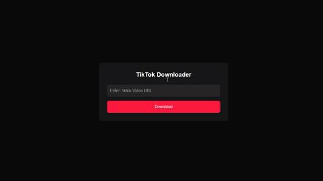

# TikTok Downloader


### A Simple and Clean TikTok  Web App for Downloading TicTok Videos


## Try it Now 
[🚀 Launch App](https://tiktok-app.geo-server.cloud)
[<kbd> <br> 🚀 Launch App <br> </kbd>][https://tiktok-app.geo-server.cloud]

## Quick Installation Methods
### 1.Clone Repository
```bash
git clone https://github.com/geovanigaldemsugar/Mytiktok.git
cd mytiktok-app
pip install -r requirements.txt
python app.py

```

### 2.Docker

#### Quick start with Docker Run
```bash
docker run -d -p 5000:5000 dragoneyes11554/mytiktok-app:latest

```
#### Quick start with Docker Compose
```yaml                       
services:
  mytiktok-app:
    container_name: mytiktok-app
    image: dragoneyes11554/mytiktok-app:latest
    ports:
      - '5000:5000'
    restart: unless-stopped
```
